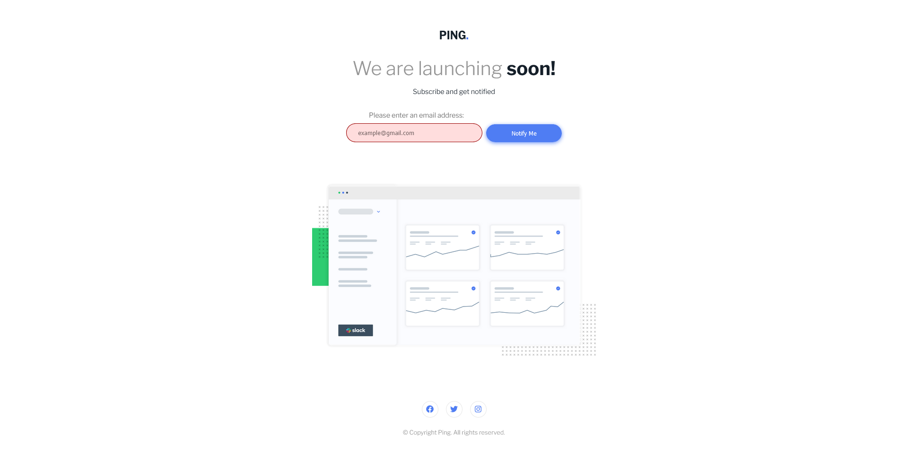

# Frontend Mentor - Ping coming soon page solution

This is a solution to the [Ping coming soon page challenge on Frontend Mentor](https://www.frontendmentor.io/challenges/ping-single-column-coming-soon-page-5cadd051fec04111f7b848da). Frontend Mentor challenges help you improve your coding skills by building realistic projects. 

## Table of contents

- [Overview](#overview)
  - [The challenge](#the-challenge)
  - [Screenshot](#screenshot)
  - [Links](#links)
- [My process](#my-process)
  - [Built with](#built-with)
  - [What I learned](#what-i-learned)
  - [Continued development](#continued-development)
  - [Useful resources](#useful-resources)
- [Author](#author)

**Note: Delete this note and update the table of contents based on what sections you keep.**

## Overview

### The challenge

Users should be able to:

- View the optimal layout for the site depending on their device's screen size
- See hover states for all interactive elements on the page
- Submit their email address using an `input` field
- Receive an error message when the `form` is submitted if:
	- The `input` field is empty. The message for this error should say *"Whoops! It looks like you forgot to add your email"*
	- The email address is not formatted correctly (i.e. a correct email address should have this structure: `name@host.tld`). The message for this error should say *"Please provide a valid email address"*

### Screenshot

### Links

- Solution URL: [Repo](https://github.com/devaramnye/ping-coming-soon-page)
- Live Site URL: [Live](https://devaramnye.github.io/ping-coming-soon-page/)

## My process

### Built with

- Semantic HTML5 markup
- CSS custom properties
- Flexbox
- CSS Grid
- Mobile-first workflow
- Javascript Vanilla
- [Styled Components](https://styled-components.com/) - For styles

### What I learned

I have learned to use The (Constraint Validation API) to create a server-side based validation with JavaScript. Learned how to create properly a form.

### Continued development

I am trying to reinforce the usage of (Constraint Validation API) and I am still learning JavaScript, trying to figure out alot of things. This is my first project with JavaScript implemented and happy to announce my first JavaScript project.

### Useful resources

- [Constraint Validation API](https://developer.mozilla.org/en-US/docs/Learn/Forms/Form_validation#the_constraint_validation_api) - This helped me to use Constraint Validation API for creating a Client-side form validation.
- [Server-side form validation](https://developer.mozilla.org/en-US/docs/Learn/Forms/Form_validation) - This is an amazing article which helped me finally understand the usage and the importance of creating a Server-side validation instead of Client-side.

## Author

- Frontend Mentor - [@devaramnye](https://www.frontendmentor.io/profile/devaramnye)